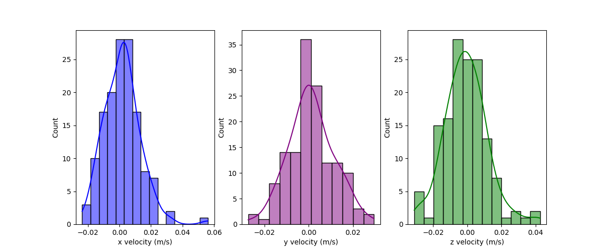

# Navigator: GNSS Research and Estimation Library


[](./LICENSE)
[](https://www.python.org/)
[](https://www.ua.edu/)
[](https://quantime.ua.edu/pntf-team.html)
[](https://github.com/astral-sh/ruff)
[](https://github.com/psf/black)

The Navigator is a Python-based GNSS library and toolkit tailored for GNSS PVT solutions. It provides a unified object-oriented API for essential GNSS data processing tasks, such as RINEX parsing, satellite position calculation, and user PVT calculation. The library is well-documented, user-friendly, and designed for extensibility. It also includes a comprehensive set of CLI tools for triangulation, data collection, and processing. Developed by the [PNTF Lab](https://quantime.ua.edu/) at the [University of Alabama](ua.edu), Navigator supports GNSS algorithm development and research.

## Features

- **RINEX Data Processing**: Simplifies RINEX data collection, parsing, and processing through an intuitive API, enabling seamless integration into applications for further analysis.

- **Satellite Tracking and Position Estimation**: Utilizes Broadcast Ephemeris and SP3 files for robust satellite tracking and accurate position estimation, essential for precise GNSS applications.

- **Single Point Positioning (SPP)**: Supports Weighted Least Squares (WLS), Extended Kalman Filter (EKF), and Unscented Kalman Filter (UKF) algorithms for enhanced position accuracy based on satellite data.

- **Simulation Module**: Includes a simulation module to simulate GPS constellations and user trajectories, aiding algorithm testing and performance improvement.

- **Epoch Interface**: Provides an Epoch Interface for handling multiple epochs of GNSS data, facilitating comprehensive data analysis and visualization across different sources.

- **Neural Interface**: Integrates a neural interface for advanced GNSS state estimation and triangulation algorithms, leveraging deep learning techniques to enhance PVT estimation.


## Installation
To install the library, user need to clone the repository from **Pntf Lab Server**(*10.116.24.69*) which is only accessible to authorized lab members. To use the **Lab Git Server**, user need to have access to the git user account. If you don't have access to the git user account, please contact the lab administrator.

**Note: The server is only accessible from the UA network. If you are not on the UA network, you need to connect to the UA VPN first.**

To install the library, first create a python virtual environment and activate it. 
**Note: This assumes that you have python3.10 installed on your system.**
```bash
# Create a virtual environment
python3 -m venv .venv

# Activate the virtual environment
source .venv/bin/activate
```

Now, after activating the virtual environment, you can install the library from the git server using a single command:
```bash
pip install git+ssh://git@10.116.24.69:2222/home/git/Navigator.git
```

Optionally to clone the repository from the git server, use the following command:
```bash
git clone ssh://git@10.116.24.69:2222/home/git/Navigator.git
```
**Note: A password prompt will appear if you are not using an SSH key.**


## Usage
The introductory tutorial for the library is documented in the *[docs](./docs//intro/)*  directory, which includes Jupyter notebooks providing basic usage of the library and its modules. Future updates will include more notebooks offering detailed usage examples for advanced library features.

### Data Collection
The data collection is done by using publicly available FTP servers. The primary source of the data is the [CDDIS](https://cddis.nasa.gov/Data_and_Derived_Products/CDDIS_Archive_Access.html) server. The data is collected using the download tools provided by the library.

There are two way of downloading the files from the FTP server.

- Using API provided by download module
- Using CLI tools provided by navigator library (Recommended)

 Two CLI tools are available for downloading the data. These tools are:
- rinex3-download-nasa (For downloading RINEXv3 files)

The command line tools are accessible only after activating the virtual environment where the navigator library is installed. To activate the virtual environment, run the following command:
```bash
source .navigator/bin/activate
```

### Satellite Tracking With Broadcast Ephemeris or SP3 Files
The navigator library provides tools for satellite tracking using broadcast ephemeris or SP3 files. The tools are demonstrated in the [Data Collection](./docs/intro//intro_parsing_and_interpolation.ipynb) notebook. The gif below shows the satellite trajcetory tracked using broadcast ephemeris.


### Single Point Positioning (SPP)
The Navigator library offers fundamental tools for calculating user positions using observation and navigation data from RINEX files. These tools are showcased in the [Single Point Positioning](./docs/intro/intro_triangulation.ipynb) notebook. The library employs the Weighted Least Squares (WLS) algorithm for SPP calculations and provides modeled atmospheric corrections. Additionally, for precise PVT (Position, Velocity, Time) calculations, users can utilize the Extended Kalman Filter (EKF) to achieve enhanced results. The below image show the positioning error of the WLS triangulation algorithm on JPLM00USA IGS station data from November 19, 2022 calculated using the Navigator library.


### PVT Estimation Using Kalman Filters
The Navigator library supports the Extended Kalman Filter (EKF) algorithms for PVT estimation. The [Kalman Filters](./docs//intro/extended_kalman_filter_gps.ipynb) notebook demonstrates the EKF algorithm for PVT estimation for JPLM00USA IGS station data from November 19, 2022. The notebook provides a detailed explanation of the EKF algorithm and its implementation in the Navigator library. The below image shows the velocity estimation results using the EKF algorithm for the JPLM00USA IGS station data. 


The EKF can be used in filtering or smoothing mode for PVT estimation. Below figure shows comparison of positing error derived from WLS and EKF triangulation algorithm on on JPLM00USA IGS station data from November 19, 2022 07:00 am to 08:25 am 


### Neural Interface
The Navigator library provides a neural interface for advanced GNSS state estimation and triangulation algorithms. The [Neural Interface](./docs//intro/pekf_gps.ipynb) notebook demonstrates the learnable varient of EKF algorithm for PVT estimation for JPLM00USA IGS station data from November 19, 2022. The notebook provides a detailed explanation of the PEKF algorithm and its implementation in the Navigator library. The below image shows comparison of positing error derived from PEKF,EKF and WLS triangulation algorithm on on JPLM00USA IGS station data from November 19, 2022 07:00 am to 08:25 am.


## API Documentation
There are multiple other modules and classes available for more fine-grained control and customization. Hence, the user can refer to the API documentation for more details. The API documentation is generated using the `pdoc` tool. To generate the API documentation, use the following command:
```bash
pdoc -o $DOC_DIR -d google navigator
```
where `$DOC_DIR` is the directory where the documentation will be generated. The documentation will be generated in the `$DOC_DIR/navigator` directory. To view the documentation, open the `index.html` file in the `$DOC_DIR/` directory in a web browser.

It is recommended to generated directly from the clone repository using the following command:
```bash
pdoc -o $DOC_DIR -d google Navigator/src/navigator
```

## Contributing
Pull requests are welcome. For major changes, please open an issue first to discuss what you would like to change. Also, please make sure to update tests as appropriate.

## License
This software is strictly licensed for use within the PNTF Lab at the University of Alabama. Usage is solely granted to active members of the PNTF Lab for academic and research purposes. No distribution rights are granted for any member. For more details, refer to the [LICENSE](LICENSE) file.
